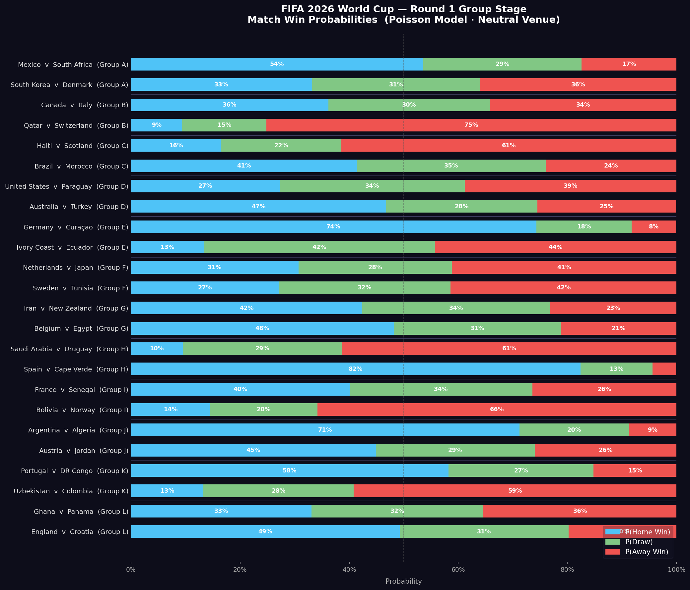

<p align="center">
  
  
  
  
  
</p>

<h1 align="center">⚽ FIFA 2026 World Cup Betting Odds Generator</h1>

<p align="center">
  <strong>A statistically grounded Poisson engine that generates match odds and championship probabilities<br>for all 48 teams in the largest FIFA World Cup in history.</strong>
</p>

<p align="center">
  <code>Raw Data → Match Weighting → Opponent-Adjusted Ratings → Poisson Odds → Monte Carlo Tournament</code>
</p>

---

<p align="center">
  
</p>
<p align="center"><em>Round 1 Group Stage — Win/Draw/Loss probabilities for all 24 opening matches (Poisson model, neutral venue)</em></p>

---

## Table of Contents

- [Overview](#-overview)
- [How It Works](#-how-it-works)
- [Pipeline Architecture](#-pipeline-architecture)
- [Key Features](#-key-features)
- [Model Deep Dive](#-model-deep-dive)
- [Project Structure](#-project-structure)
- [Getting Started](#-getting-started)
- [Sample Outputs](#-sample-outputs)
- [Limitations & Future Work](#-limitations--future-work)
- [License](#-license)

---

## 📖 Overview

The **FIFA 2026 World Cup** introduces an unprecedented format — **48 teams**, **12 groups**, and **104 matches**. This project builds a complete analytical pipeline that goes from raw historical international football data to fully simulated championship odds, using the same mathematical foundation employed by professional bookmakers worldwide.

<table>
<tr>
<td width="50%">

### At a Glance

| Metric | Value |
|:--|:--|
| Historical matches used | ~3,400+ (post-2018) |
| Team strength model | Opponent-adjusted iterative (Dixon-Coles style) |
| Match probability model | Poisson score matrix (11×11, up to 10 goals/side) |
| Group stage simulations | 10,000 per analysis run |
| Full tournament simulations | 5,000 end-to-end |
| Teams covered | 48 — all 2026 FIFA World Cup participants |
| Venue assumption | Neutral (H = 1.0) for all World Cup matches |

</td>
<td width="50%">

### Outputs

| Output | Description |
|:--|:--|
| **Match Odds** | P(Win), P(Draw), P(Loss) + implied decimal odds for every group-stage match |
| **P(Champion)** | Fraction of simulations each team wins the Final |
| **P(Finalist)** | Fraction reaching the Final as runner-up |
| **P(Semi-Final)** | Fraction appearing in either semi-final |
| **Implied Odds** | Decimal odds clipped at 999× for all outcomes |

</td>
</tr>
</table>

---

## ⚙️ How It Works

The model chains five major stages — each one feeding directly into the next:

```
┌──────────────┐     ┌──────────────────┐     ┌───────────────────┐     ┌─────────────────┐     ┌───────────────────┐
│  Historical   │────▶│  Match Weighting  │────▶│  Opponent-Adjusted │────▶│  Poisson Match   │────▶│  Monte Carlo       │
│  Match Data   │     │  (Importance ×    │     │  Team Strength     │     │  Probability     │     │  Tournament        │
│  (post-2018)  │     │   Recency Decay)  │     │  Ratings (40 iter) │     │  Model (11×11)   │     │  Simulation (5K)   │
└──────────────┘     └──────────────────┘     └───────────────────┘     └─────────────────┘     └───────────────────┘
```

**Stage 1 — Data Foundation:** Filter ~3,400+ international matches from 2018–present. Drop incomplete records, parse dates, preserve tournament metadata.

**Stage 2 — Match Weighting:** Assign dual weights to every historical match — a **tournament importance weight** (World Cup finals = 4.0× → friendlies = 1.0×) multiplied by a **recency decay weight** (≤180 days = 1.0 → >4 years = 0.10).

**Stage 3 — Opponent-Adjusted Ratings:** Iteratively fit attack and defense multipliers for every team using a Dixon-Coles–inspired algorithm over 40 iterations, with Bayesian shrinkage (prior = 20.0) to prevent small-sample blowup.

**Stage 4 — Poisson Match Model:** Convert team ratings into expected goals (λ), then compute a full 11×11 joint probability matrix for every possible scoreline 0–10. Sum the matrix to derive P(Home Win), P(Draw), P(Away Win).

**Stage 5 — Monte Carlo Simulation:** Run 5,000 complete World Cup tournaments end-to-end — group stage → third-place assignment (recursive backtracking) → R32 → R16 → QF → SF → Final. Aggregate to produce championship probabilities and implied decimal odds.

---

## Pipeline Architecture

```
results.csv                         FIFA2026_schedule_Fixtures.csv
     │                                        │
     ▼                                        ▼
 ┌────────────────┐                  ┌──────────────────┐
 │  Date Filter   │                  │  Group & Bracket │
 │  (≥ 2018-01)   │                  │  Extraction      │
 └───────┬────────┘                  └────────┬─────────┘
         ▼                                    │
 ┌────────────────┐                           │
 │  Importance ×  │                           │
 │  Recency       │                           │
 │  Weighting     │                           │
 └───────┬────────┘                           │
         ▼                                    │
 ┌────────────────────────┐                   │
 │  Opponent-Adjusted     │                   │
 │  Strength Ratings      │                   │
 │  (40 iter, prior=20)   │                   │
 │  ┌───────┐ ┌────────┐  │                   │
 │  │ ATK_i │ │ DEF_i  │  │                   │
 │  └───────┘ └────────┘  │                   │
 └───────────┬────────────┘                   │
             ▼                                │
 ┌────────────────────────┐                   │
 │  Poisson Score Matrix  │                   │
 │  P[i][j] for 0..10    │                   │
 │  → P(H), P(D), P(A)   │                   │
 └───────────┬────────────┘                   │
             │         ┌──────────────────────┘
             ▼         ▼
 ┌──────────────────────────────────┐
 │     Monte Carlo Tournament      │
 │  ┌────────────────────────────┐  │
 │  │  Group Stage (12 groups)   │  │
 │  │  Top 2 + Best 8 of 12 3rd │  │
 │  └─────────────┬──────────────┘  │
 │  ┌─────────────▼──────────────┐  │
 │  │  3rd-Place Slot Assignment │  │
 │  │  (Recursive Backtracking)  │  │
 │  └─────────────┬──────────────┘  │
 │  ┌─────────────▼──────────────┐  │
 │  │  Knockout Bracket          │  │
 │  │  R32 → R16 → QF → SF → F  │  │
 │  │  (90' → ET → Pens)        │  │
 │  └────────────────────────────┘  │
 │           × 5,000 sims          │
 └──────────────────────────────────┘
             │
             ▼
 ┌──────────────────────────┐
 │  Championship Odds Table │
 │  P(Champion) | P(Final)  │
 │  P(Semi)   | Decimal Odds│
 └──────────────────────────┘
```

---

## Key Features

### Opponent-Adjusted Ratings (Dixon-Coles Style)
Raw goal averages are misleading — scoring 3 goals per game against minnows ≠ , scoring 1.5 against elite opposition. The iterative model simultaneously fits attack and defense multipliers for every team, fully accounting for opponent quality across **every** weighted match.

```
λ_home(i,j)  =  base × H × ATK_i × DEF_j
λ_away(i,j)  =  base × ATK_j × DEF_i
```

### ⚖️ Dual-Weight System
Each historical match is scored on two independent axes, combined multiplicatively:

| Dimension | Range | Examples |
|:--|:--|:--|
| **Tournament Importance** | 1.0 – 4.0 | WC Finals (4.0), Qualifiers (3.0), Nations League (2.5), Friendlies (1.0) |
| **Recency Decay** | 0.10 – 1.00 | ≤180 days (1.00), ≤1 year (0.85), ≤2 years (0.70), >4 years (0.10) |

### 2026 Format Compliance
Built for the **new 48-team, 12-group format** — including the complex third-place slot assignment algorithm (recursive backtracking, most-constrained-first) that correctly maps the best 8 of 12 third-place finishers to their eligible Round of 32 slots.

### Three-Phase Knockout Resolution
Knockout matches that end in a draw are resolved through a realistic three-phase simulator:

| Phase | Mechanism | λ Modifier |
|:--|:--|:--|
| 90 Minutes | Standard Poisson draw | Full λ |
| Extra Time (30 min) | Fatigue-adjusted Poisson | λ × 0.30 |
| Penalties | Strength-nudged coin flip | 50% ± 3%, clipped [0.47, 0.53] |

### 🔧 Transparent Data Quality Fixes
Seven team name mismatches resolved (`USA` → `United States`, `IR Iran` → `Iran`, `Türkiye` → `Turkey`, etc.), unconfirmed playoff slots resolved to strongest model candidate, and a pre-simulation diagnostic ensures **zero** fallback teams.

---

## Model Deep Dive

### Iterative Strength Algorithm (40 Iterations)

```python
Initialize  A_i = 1.0,  D_i = 1.0   ∀ teams

For each iteration:
    1.  Compute expected goals using current A, D vectors
    2.  A_new = (Σ actual_goals × W + prior) / (Σ expected_goals × W + prior)
    3.  D_new = (Σ conceded × W + prior)     / (Σ expected_goals × W + prior)
    4.  Re-normalize A, D → mean = 1.0  (prevents scale drift)
```

### Poisson Score Matrix

An 11×11 joint probability matrix **P[i][j]** is computed for all scorelines 0–10:

| Outcome | Derivation |
|:--|:--|
| **P(Home Win)** | Sum of lower triangle: Σ P[i][j] where i > j |
| **P(Draw)** | Trace of matrix: Σ P[i][i] |
| **P(Away Win)** | Sum of upper triangle: Σ P[i][j] where j > i |
| **Implied Odds** | 1 / P(outcome) — e.g., P = 0.45 → 2.22× |

### Quality Filters

| Parameter | Value | Purpose |
|:--|:--|:--|
| Bayesian prior | 20.0 | Shrinks low-sample teams toward global mean |
| MIN_MATCHES | 8 | Minimum matches to qualify for `teams_rankable` |
| MIN_WEIGHT_SUM | 10.0 | Minimum total weight to enter the rankable pool |
| Normalization | Mean = 1.0 | Re-centered after every iteration |

---

## Project Structure

```
FIFA2026-WorldCup-BettingOdds/
│
├── FIFA2026_WorldCup_BettingOdds.ipynb   # Main notebook — 65 cells, full pipeline
├── FIFA2026_WorldCup_BettingOdds_Report.pdf  # Technical report (16 pages)
│
├── results.csv                           # Historical intl. match results (1872–present)
├── FIFA2026_schedule_Fixtures.csv        # Official 2026 fixture schedule (104 matches)
│
├── round1_odds_chart.png                 # Round 1 match probability visualization
├── README.md                             # You are here
└── LICENSE
```

---

## Getting Started

### Prerequisites

```bash
Python 3.8+
```

### Installation

```bash
# Clone the repository
git clone https://github.com/<your-username>/FIFA2026-WorldCup-BettingOdds.git
cd FIFA2026-WorldCup-BettingOdds

# Install dependencies
pip install pandas numpy matplotlib seaborn
```

### Run

```bash
# Launch the notebook
jupyter notebook FIFA2026_WorldCup_BettingOdds.ipynb
```

Execute all cells sequentially. The full pipeline — from data loading to 5,000-simulation championship odds — runs in a single notebook execution.

> **Reproducibility:** The RNG is seeded (`numpy.random.default_rng(42)`) — identical results on every run.

---

## 📊 Sample Outputs

### Round 1 Group Stage Odds (Selected Matches)

| Match | Home | Away | P(Home) | P(Draw) | P(Away) | Odds H | Odds D | Odds A |
|:--|:--|:--|:--:|:--:|:--:|:--:|:--:|:--:|
| M1 | Mexico | South Africa | 54.8% | 26.2% | 19.0% | 1.83× | 3.82× | 5.26× |
| M7 | Brazil | Morocco | 60.4% | 23.5% | 16.1% | 1.66× | 4.26× | 6.21× |
| M10 | Germany | Curaçao | 82.3% | 13.2% | 4.5% | 1.22× | 7.58× | 22.2× |
| M14 | Spain | Cape Verde | 76.2% | 17.2% | 6.6% | 1.31× | 5.81× | 15.2× |
| M17 | France | Senegal | 61.9% | 22.8% | 15.3% | 1.62× | 4.39× | 6.54× |
| M19 | Argentina | Algeria | 69.3% | 19.8% | 10.9% | 1.44× | 5.05× | 9.17× |
| M22 | England | Croatia | 57.0% | 24.8% | 18.2% | 1.75× | 4.03× | 5.49× |
| M23 | Portugal | New Caledonia | 91.2% | 7.5% | 1.3% | 1.10× | 13.3× | 76.9× |

### Resolved Group Assignments

| Group | Team 1 | Team 2 | Team 3 | Team 4 |
|:--:|:--|:--|:--|:--|
| **A** | Denmark | Mexico | South Africa | South Korea |
| **B** | Canada | Italy | Qatar | Switzerland |
| **C** | Brazil | Haiti | Morocco | Scotland |
| **D** | Australia | Paraguay | Romania | United States |
| **E** | Curaçao | Ecuador | Germany | Ivory Coast |
| **F** | Japan | Netherlands | Poland | Tunisia |
| **G** | Belgium | Egypt | Iran | New Zealand |
| **H** | Cape Verde | Saudi Arabia | Spain | Uruguay |
| **I** | France | Norway | Senegal | Suriname |
| **J** | Algeria | Argentina | Austria | Jordan |
| **K** | Colombia | New Caledonia | Portugal | Uzbekistan |
| **L** | Croatia | England | Ghana | Panama |

---

## Limitations & Future Work

### Current Limitations

- **Unconfirmed playoff slots** — six inter-confederation positions resolved to strongest model candidate; confirmed teams will shift odds
- **No bookmaker overround** — odds are fair-value (probabilities sum to 100%); real markets include 5–10% vigorish
- **No squad-level data** — cannot account for injuries, suspensions, or call-up refusals
- **Independent Poisson assumption** — does not apply the Dixon-Coles low-score correlation correction for 0-0, 1-0, 0-1 scorelines
- **Fixed bracket only** — any FIFA format changes require bracket data updates

### Planned Enhancements

- [ ] Apply bookmaker overround (5–8% vigorish) for market-style pricing
- [ ] Add Dixon-Coles low-score correlation correction
- [ ] Integrate Elo ratings as a cross-validation layer
- [ ] Build a market comparison module to identify value bets (model odds vs. bookmaker odds)
- [ ] Extend to Asian Handicap and Over/Under markets using the full scoreline matrix
- [ ] Add squad-level injury/suspension overrides
- [ ] Automate fixture CSV ingestion for live odds updates as playoff results are confirmed

---

## 🛠️ Technology Stack

| Component | Technology |
|:--|:--|
| Language | Python 3 |
| Data Manipulation | `pandas`, `numpy` |
| Visualization | `matplotlib`, `seaborn` |
| Probability Engine | Custom Poisson model (scipy-free) |
| Simulation RNG | `numpy.random.default_rng(seed=42)` |
| Environment | Jupyter Notebook (.ipynb) |

---

## License

This project is for educational and analytical purposes only. Not intended for commercial gambling use.

---

<p align="center">
  <strong>Built with 📊 data, ⚽ passion, and 🎲 5,000 simulations.</strong>
</p>
